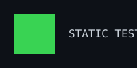

<h3><code>$ whoami</code></h3>

rmeilan-aitech

 

<h3><code>$ cat activity.log</code></h3>

 
 

<h3><code>$ ./render --portrait --sysinfo</code></h3>

<table>
<tr>
<td></td>
<td></td>
</tr>
</table>

 

<h3><code>$ tail -f README.md</code></h3>

Este perfil se regenera solo cada día vía GitHub Actions.
 
Retrato, info-card y heatmap se recalculan a partir de datos públicos.

